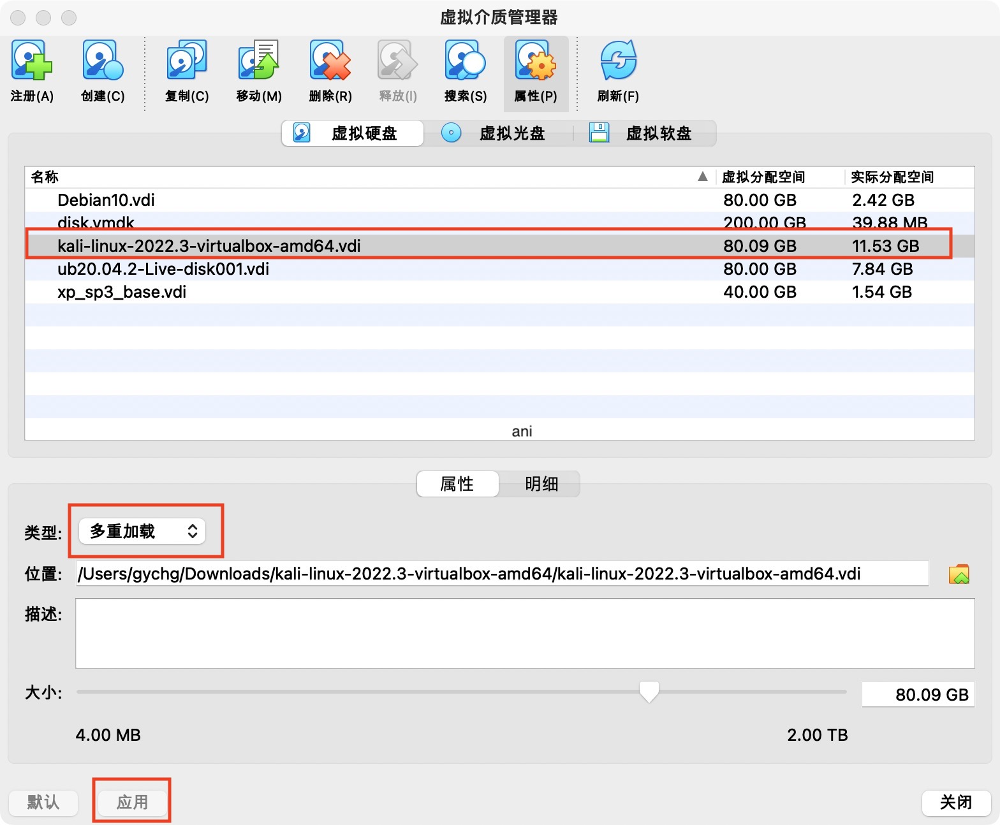

### 基于 VirtualBox 的网络攻防基础环境搭建

---

#### 实验目的

* 掌握 `VirtualBox`虚拟机的安装与使用；
* 掌握 `VirtualBox` 的虚拟网络类型和按需配置；
* 掌握 `VirtualBox` 的虚拟硬盘多重加载；
  
#### 实验环境

* 计算机 ：`MacOS 12.3.1`
* 虚拟机 ：`VirtualBox 6.1`
* 攻击者主机（ Attacker ）：`Kali Rolling 2019.2`
* 网关（ Gateway, GW ）：`Debian Buster`
* 靶机（ Victim ）：`From Sqli to shell / xp-sp3 / Kali`
  
#### 实验要求

* 虚拟硬盘配置成多重加载；
* 搭建满足作业拓扑图所示的虚拟机网络拓扑；
* 完成以下网络连通性测试： 
    * 靶机可以直接访问攻击者主机 
    * 攻击者主机无法直接访问靶机 
    * 网关可以直接访问攻击者主机和靶机 
    * 靶机的所有对外上下行流量必须经过网关 
    * 所有节点均可以访问互联网
  
#### 实验过程

##### 一.虚拟硬盘配置成多重加载

以下展示以 `Kali` 为例的操作：
1. 在 `virtual box` 中从 `管理—虚拟介质管理` 打开虚拟介质管理器
2. 选中 `Kali.vdi` ，点击释放
3. 点击类型，选择多重加载，并应用



##### 二.搭建拓扑图所示的虚拟机网络拓扑

拓扑图如下：

通过分析实验要求和拓扑图，可以发现：
1. 我们需要对网关配置四块网卡
2. 需要搭建局域网 `Network-1` 和 `Network-2`
3. 需要对攻击者配置两块网卡

分析图如下：


##### 网关的网卡配置

网关需要四块网卡：
1. `NAT` 网络，使网关可以访问攻击者主机，联网
2. `Host-Only` 网络，进行网卡设置
3. 内部网络 `intnet1` ，搭建局域网 `Network-1`
4. 内部网络 `intnet2` ，搭建局域网 `Network-2`


##### 攻击者的网卡配置

攻击者需要配置两块网卡：
1. `NAT` 网络
2. `Host-Only` 网络


##### 局域网的搭建

以局域网 Network-1 为例：
Victim-XP-1 和 Victim-Kali-1在同一局域网 Victim1 内，均需要配置内部网络 intnet1


> 内存 > 1024 M 的 Windows XP 系统需要更改控制芯片如下：


##### 三、连通性测试

##### 查询各主机ip地址


|  主机   | IP地址  |
|  ----  | ----  |
| Kali-Attacker  | 10.0.2.5 |
| Victim-1-Windows XP  | 172.16.111.131 |
| Victim-1-Kali  | 172.16.111.143 |
| Victim-2-Windows XP  | 172.16.222.149 |
| Victim-2-Debian  | 172.16.222.146 |

##### 靶机可以直接访问攻击者主机

`Network-1` 中的靶机可以直接访问攻击者主机：


`Network-2` 中的靶机可以直接访问攻击者主机：


##### 攻击者主机无法直接访问靶机

攻击者主机无法直接访问 `Network-1` 中的靶机：


攻击者主机无法直接访问 `Network-2` 中的靶机：


##### 网关可以直接访问攻击者主机和靶机

网关可以直接访问攻击者主机：


网关可以直接访问 `Network-1` 中的靶机：


网关可以直接访问 `Network-2` 中的靶机：


##### 靶机的所有对外上下行流量必须经过网关

在网关安装 `tcpdump` 和 `tmux`

抓包命令 `sudo tcpdump -c 5`

`Network-1` 中的靶机：


`Network-2` 中的靶机：


`tmux` 将抓包数据文件复制到主机用 `Wireshark` 分析：

```bash
cd workspace
tcpdump -i enp0s9 -n -w 20211010.1.pcap
```


配置主机与虚拟机的端口映射：

在 `设置 -- 网络 -- 网卡1 -- 端口转发`：


`scp -P 2222 cuc@127.0.0.1:root/workspace/20211010.1.pcap /Users/gychg/Desktop`

然后在 **`Wireshark`** 中分析抓下来的数据包


说明靶机和互联网互通的过程中用网关抓包，靶机发送的所有包都能被网关抓到，即靶机的所有对外上下行流量必须经过网关

##### 所有节点均可以访问互联网

网关可以正常访问互联网：


`Network-1` 中的靶机可以直接访问互联网：


`Network-2` 中的靶机可以直接访问互联网：


攻击者可以正常访问互联网：


#### 实验总结

1. 实验要求已全部完成
   
2. 攻击者主机无法直接访问到靶机是因为：靶机在局域网内使用的是虚拟ip地址，该局域网以外的机器访问无效
   
3. 在局域网内的靶机访问互联网需要通过网关获取地址
   
4. 遇到的问题：

* 网关无法直接访问 `Network-1` 中的靶机
   * 手动关闭 `Victim-1-Windows XP` 的 `Windows 安全中心 - Windows 防火墙` ，如图：
   * 
  
* 端口转发配置后，使用 `scp` 传输文件时有如下报错：
  
  原因大致为没有配置远程登录虚拟机的密码还有没说明映射端口
  解决：配置本地免密远程登录虚拟机
  然后在本地 `iTerm` 输入命令：
 
  ```bash
  ssh-copy-id -i ~/.ssh/id_rsa.pub -p 2222 'cuc@127.0.0.1'
  ```
  于是报以下的错：
  
  以前配置远程登录的时候好像也试过这个报错，但具体怎么处理忘记了，于是去搜索引擎找到如下解决方法：
  **该报错是因为**在主机系统每次 `ssh` 连接远程操作后，都会把你每个访问过计算机的公钥都记录在主机的目录 `/Users/.ssh/known_hosts` 下，当下次访问相同子机服务器时，会核对公钥。如果公钥不同，会发出警告 `“Host key verification failed”` 。我们在文件中删掉不能登录的对应 `IP` 即可重新登录
  ```bash
  vi ~/.ssh/known_hosts #用vi打开文件
    ```
  然后还是像第一个图那样显示要输密码，输了密码之后报错： `Permission denied,please try again` 
  然后又一顿操作还是报错，最后发现是目录写错了哈哈哈
  应该写：
  ` scp -P 2222 root@127.0.0.1:/root/workspace/20211010.1.pcap /Users/gychg/Desktop`

#### 参考资料

[解决Host key verification failed](https://www.jianshu.com/p/9bb934837511)

---

#### 课后思考题

##### 一、
##### 以下⾏为分别破坏了 CIA 和 AAA 中哪⼀个属性或多个属性？

CIA ：保密性、完整性、可用性
AAA ：认证、授权、审计

1. 小明抄小强的作业：破坏了 CIA 的保密性， AAA 的认证和授权

2. 小明把小强的系统折腾死机了：破坏了 CIA 的可用性， AAA 的授权

3. 小明修改了小强的淘宝订单：破坏了 CIA 的保密性和完整性， AAA 的认证、授权和审计

4. 小明冒充小强的信用卡账单签名：破坏了 CIA 的完整性， AAA 的认证、授权和审计

5. 小明把自⼰电脑的 IP 修改为小强电脑的 IP ，导致小强的电脑⽆法上⽹：破坏了 CIA 的可用性和机密性， AAA 的认证、授权


##### 二、

##### 有⼀次，小明⼝袋里有 100 元，因为打瞌睡，被小偷偷⾛了，搞得晚上没饭吃。又⼀天，小明⼝袋里有 200 元，这次小明为了防范小偷，不打瞌睡了，但却被强盗持⼑威胁抢⾛了，搞得⼀天没饭吃，小明当天就报警了。

1. 试分析以上故事两次失窃事件中的：风险、资产、威胁、弱点、攻击、影响:


2. 试用 P2DR 模型分析案例中的“现⾦被抢”事件中的安全策略、安全防护、安全检测和安全响应:


3. “ 被抢 ”事件中，小明的安全策略存在的问题:
小明直接把钱放在口袋，容易被偷或抢

##### 三、
##### 试分析“ CAPTCHA 图片验证码技术可以阻⽌恶意批量注册⾏为”这句话中的安全策略、安全机制和安全假设分别是什么？ CAPTCHA 图片举例


安全策略：认证注册用户的身份真实性、判断注册用户是否为机器人等

安全机制：通过验证邮箱真实性和用户计算验证码认证

安全假设：想要恶意批量注册的用户没有能够完成这些认证的程序

##### 四、
##### 你认为以下安全机制能达到总裁的预期安全效果吗？为什么？
>某⼤型软件开发公司的总裁担⼼公司的专利软件设计⽅法被内部员⼯泄露给其他公司，他打算防⽌泄密事件的发⽣。于是他设计了这样⼀个安全机制： 所有员⼯必须每天向他汇报自⼰和其他竞争对⼿公司员⼯的所有联系(包括 IM 、电⼦邮件、电话等等) 。

我认为不能，因为该安全机制建立在所有员工都会每天向他汇报自己的所有联系信息的安全假设上，但员工如果恶意泄露公司信息、隐瞒不报，则仍会发生泄密事件，即不满足总裁预期的安全效果