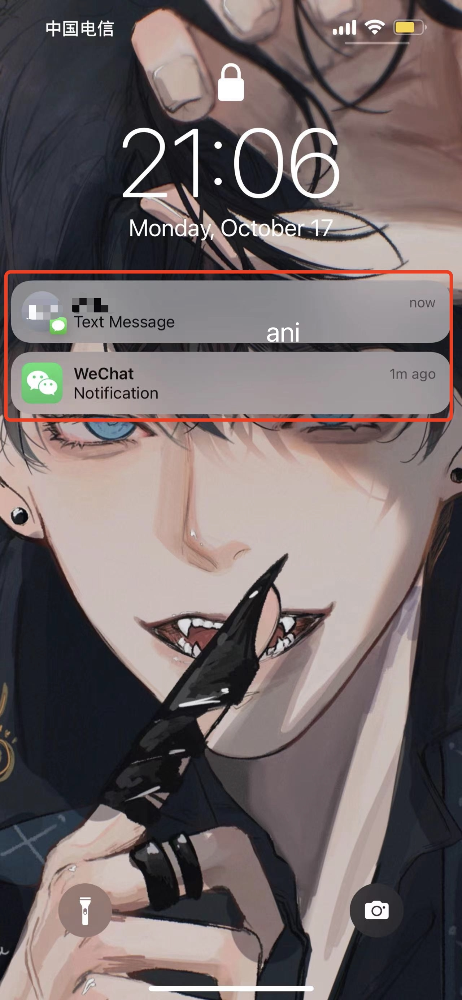
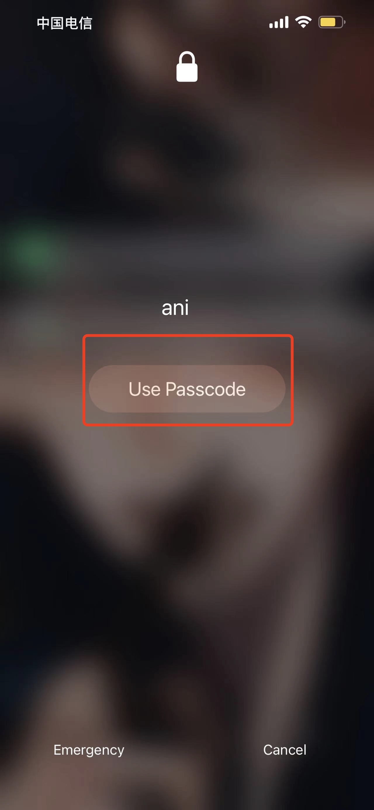
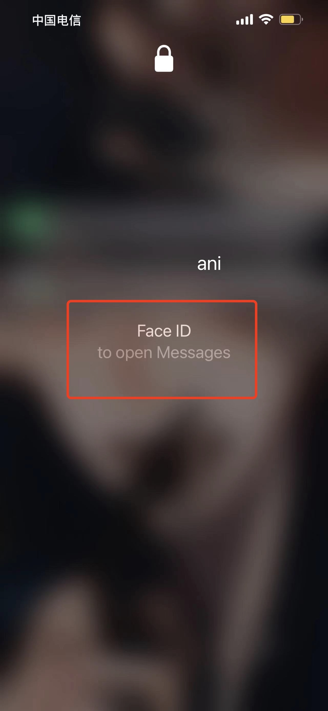

# 操作系统的访问控制设计实例研究

## 实验环境

操作系统：`iOS 15.6.1`
实验设备：`iPhone 13 Pro Max`

## 实验目的

以 `iOS` 或 `Android` 系统为研究对象，探索系统的访问控制设计

## 实验内容

- 当系统处于锁屏状态下接收到新短信时，不解锁情况下
  
  - 本实验中手机的**默认设置**为解锁手机后所接收的信息可直接查看，未解锁的情况下不解锁手机不能查看

  - 系统是否允许查看短信内容？
    - 不允许
    - 但是短信的发送人如果是通讯录里的联系人，会显示名字
    - 
    
  - 系统是否允许回复短信
    - 不允许
    - 需要通过人脸识别或密码解锁
    - 
    - 
  
- 当系统处于锁屏状态下，使用系统内置（例如 `iOS` 的 ` Siri` ）或第三方的语音助手可以完成以下哪些操作？ 

    - 访问通讯录：
        - 不能，需要先解锁
        - 

    - 拨打电话
        - 可以，直接拨号或者通讯录备注都可以
        - 

    - 访问相册
        - 不能，需要先解锁
        - 

    - 查看短信收件箱
        - 不能，需要先解锁
        - 

- 如果你的手机支持指纹识别解锁手机，请实验并分析指纹识别相比较于简单密码、复杂密码、图形解锁、人脸识别解锁、声纹解锁等解锁方式的安全性、便利性差异。
  - 不支持 **指纹解锁** ，支持 **人脸识别** 。但相比起之前用的 **华为nova7pro** 所用的指纹识别，在光线好时举起手机就能解锁，非常方便。现在佩戴口罩也能解锁，但没有遮挡的解锁率要高很多，猜测戴口罩时使用的是 **虹膜识别** 。我的眼睛是那种与紫外线变色的眼镜，发现有时眼镜变色了也能解锁，在手机设置里还能分别录入戴眼镜和不戴眼镜的面部，能更好地提高识别的效率。 **人脸识别** 比起简单密码、复杂密码、图形解锁和声纹解锁都要更方便。且简单密码和图形解锁易被偷窥或破解，而当手指有水或灰多的时候，指纹识别不灵敏。

## 思考题：

### 以上设计实现方式属于我们课堂上讲过的哪种强制访问控制模型？Lattice/BLP？Biba？
  
- `BLP/Lattice` 模型：允许上写下读
- `Biba` 模型：允许上读下写
- 上述设计实现方式更符合 `Biba` 模型

### 系统或第三方应用程序是否提供了上述功能的访问控制规则修改？如果修改默认配置，是提高了安全性还是降低了安全性？

- 在手机的设置中提供了访问规则修改，如果选择总是显示消息，那么在没有解锁的情况下就可以查看消息，并且回复内容，这种情况下无论是谁都能查看手机内容甚至回复，降低了安全性；而当选择从不显示消息，则即使解锁了手机，当微信有新消息时，而此时用户不处于微信界面中，则只会收到消息提醒而也无法直接查看消息的内容，那么如果身边有别人也可以自主选择是否查看消息，这种情况下则提高了安全性。

---

## 课后思考题
&nbsp;
#### 1.生物特征身份认证方式有哪些？优缺点分析？应用场景举例。

**指纹识别**：

- **优点**：
 
    - **独特性**：没有两个人的指纹是相同的
    - **稳定性**：不易变化
    - **方便性**：采集硬件设备易实现

- **缺点**：
  
    - 由于易采集，一旦被居心不良的人拿到指纹，且指纹不会改变，和指纹相关的个人信息或财产权益将遭到威胁，**存在安全隐患**
    - 据英国《每日邮报》报道，老年人、体力劳动者和癌症患者的指纹很**可能因为衰老、磨损以及治疗副作用等因素而发生改变**，从而导致指纹无法被识别
  
- **应用场景**：
  
    - **身份认证**：“指纹”是指人的手指表面由交替的“脊”和“谷”组成的平滑纹理模式，这些皮肤的纹路在图案、断点和交叉点上各不相同，是唯一的。依靠这种**唯一性**，可以把一个人与他的指纹对应起来，确定人的身份。**具体应用**有：门禁系统、第三方支付平台、网上银行软件和手机解锁等。
    - **刑侦办案**：它可以提高公安机关破案率，同时有效节省成本。
&nbsp;

**虹膜识别**：

  - **优点**：

    - **稳定性**：不易变化
    - **非接触式**：避免传播病毒，便于非典、新冠等特殊期间的身份识别
    - **高精准性**：虹膜认证的错误率在所有的生物特征识别中是最低的
    - **不可伪造性**：虹膜（眼睛中的彩色部分）是眼球中包围瞳孔的部分，上面布满极其复杂的锯齿网络状花纹，而**每个人虹膜的花纹都是不同的**

  - **缺点**：

    - 不易实现
    - 技术复杂
 
  - **应用场景**：

    - **管理和认证身份**：教育考试、门禁考勤、特殊职业的人员认证（避免无证上岗造成危险）
    - **提高识别系统的安全**：减少银行金融的诈骗事件及其损失
&nbsp;

**人脸识别**：

  - **优点**：
  
    - 操作简单
    - 结果直观
    - **隐蔽性好**：人脸信息能以最自然、最直接的方式获取
    - 目前人脸识别技术涉及的图像逐渐复杂，识别效果和**准确性**不断地得到提高
  
  - **缺点**：
    - **人脸自身及所处环境的复杂性**，如表情、姿态、图像的环境光照强度等条件的变化以及人脸上的遮挡物（眼镜、胡须）等，都会使人脸识别方法的**正确性受到很大的影响**
  
  - **应用场景**：
 
    - **身份识别**：在用户非配合状态下的快速身份识别技术，远距离快速确认人员身份，实现智能预警
    - **监视**：在公共场合监控不良行为，给想要违法犯罪的人一种警告
    - **查询目标人像档案**：公安部门可以通过人像寻找数据库中是否存在重点人口或犯罪嫌疑人
&nbsp;

**声纹识别**：

  - **优点**：
  
    - 收集简单隐蔽
    - 收集成本低
    - 声纹辨认和确认的算法复杂度低
  
  - **缺点**：

    - 同一个人的声音具有易变性，易受身体状况、年龄、情绪等的影响
    - 声音传递的介质不同会影响识别的准确性
    - 最近有通过 `ai` 合成声音诈骗的案例，声纹识别对收集到的样品保密性要求高
  
  - **应用场景**：
 
    - **身份识别**：安全准确地远程识别和确认社保对象的身份判断养老金是否冒充顶替领取
    - 让 `siri` \ `小爱同学` 之类的手机 `ai` 更好服务用户

#### 2.“找回口令功能”和“忘记密码”在访问授权机制中的意义？请尝试设计几种安全的“找回口令功能”，详细描述找回口令的用户具体操作过程。

“找回口令功能”和“忘记密码”是当**已经授权的用户**忘记口令是客体所提供的**重新获取权限**的方式

**设计一**：

**主要思想**：好友验证

**具体操作**：当忘记密码时，用户申请找回密码，通过**手机验证码**验证账号存在后，进入找回页面。该页面将有一个**口令**，需要该账号的**好友向该账号发送该口令**，且可以从该页面查看帮助进度。大约需要三到五个好友。足够好友帮忙后，绑定的邮箱将收到更改密码的链接，点击按步骤可更改密码

**设计二**：

**主要思想**：多因素认证

**具体操作过程**：当忘记密码时，用户需要通过**人脸识别**验证账号存在后，进入手机验证码验证页面，用户通过输入应用发送的**手机验证码**可以获得修改密码的权限。若用户更换手机号码，则需要点击绑定的邮箱收到的**激活账号的链接**，并完成新手机号的认证和身份证号码的**实名认证**。

#### 3.绘制用户使用用户名/口令+图片验证码方式录系统的流程图。考虑认证成功和失败两种场景，考虑授权成功和失败两种场景。

#### 4.Windows XP / 7 中的访问控制策略有哪些？访问控制机制有哪些？

**访问控制策略**：
- **自主访问控制**`（Discretionary Access Control）`：自主访问控制（Discretionary Access Control, DAC）的特点是根据主体的身份及允许访问的权限进行决策。所谓自主是指具有某种访问能力的主体能够自主地将访问权的某个子集授予其他主体。
- **强制访问控制**`（Mandatory Access Control）`：强制访问控制是基于用户和资源分级（“安全标签”）的，一般是多级访问控制。所谓安全标签是分配在目标上的一组安全属性信息项。在访问控制中，一个安全标签隶属于一个用户（主体）、一个目标（客体）、一个访问请求或传输中的一个访问控制信息。
- **基于角色的访问控制**（`Role-Based Access Control）`：一个身份被分配给一个被授权的组。在访问控制列表中，每一个用户或用户组都对应一组访问控制项。

**访问控制机制**：

- **身份认证**：将身份标识唯一的绑定到主体

- **访问授权**：主体无法将自己不具备的权限授予他人

- **访问审计**：主体对客体的访问行为会被记录

#### 5.用权限三角形模型来理解并描述下 2 种威胁模型：提权、仿冒。

**提权**：是指本来没有某项权限的用户，通过一定的方法获得该权限，即用户以自己的身份获得了自己原本没有的权限。角色获得分派的权限扩大

**仿冒**：是指用户A以用户B的身份通过了认证，之后行使了B所有的权利。用户通过改变角色改变权限

#### 6.试通过操作系统的访问控制机制来达到预防一种真实病毒的运行目的。

管理员配置好可执行文件的读写权限使得低权限用户没有对其程序的写入权限，避免程序被病毒替换成任意可执行程序

#### 7.什么是 `OAuth`？

**`OAuth`**是互联网上的**一款安全协议**，其全称为 `Open Authorization` 。 **`OAuth` **协议为**用户资源的授权**提供了一个**安全的、开放而又简易**的标准。与以往的授权方式不同之处是 **`OAuth`** 的授权**不会**使第三方触及到用户的帐号信息(如用户名与密码)，即第三方**无需**使用用户的用户名与密码就可以申请获得该用户资源的授权，因此 **`OAuth`** 是安全的。

#### 8.什么是 `OpenID`？

**`OpenID`** 是一个**去中心化**的**网上身份认证系统**。对于支持 **`OpenID`** 的网站，用户不需要记住像用户名和密码这样的传统验证标记。取而代之的是，他们只需要预先在一个作为 **`OpenID`** 身份提供者的网站上**注册**。 **`OpenID`** 是去中心化的，任何网站都可以使用 **`OpenID`** 来作为用户登录的一种方式，任何网站也都可以作为 **`OpenID`** **身份提供者**。

#### 9.试用本章所学理论分析 0Auth 和 OpenID 的区别与联系。

**区别** ：**`OAuth`** 关注的是授权`（authorization）`，即：“用户能做什么”；而 **`OpenID`** 关注的是证明`(authentication)`，即：“用户是谁”。

**联系** ：他们都应用于 **访问控制**

#### 10.如何使用 OAuth 和 OpenID 相关技术实现单点登录（Single Sign On）？

**单点登录**：多个站点**共用**一台**认证授权**服务器（用户数据库和认证授权模块共用）。用户经由其中任何一个站点登录后，可以**免登录**访问其他所有站点。而且，各站点间可以通过该登录状态**直接交互**。

首先用户在一个 **`OpenID`** 服务器网站 `A` 注册账户，获得一个 `URL`。当用户想要登录网址 `B`时，用 **`OpenID`** 实现身份认证并登录，即跳转到网站 `A` 输入用户名密码，并询问是否登录到网址 `B` ，用户确认，则再跳转回网址 `B` ，这就实现了使用 **`OpenID`** 登录网站 `B` ，再利用 **`OAuth`** ，即可在网站 `B` 获得网站 `A` 的用户信息和权限，从而实现 **`SSO`**
