# 基于 Scapy 编写端口扫描器

## 实验目的

掌握网络扫描之端口状态探测的基本原理

## 实验环境

- `python + scapy + namp`
- `Kali`

## 实验要求
- 禁止探测互联网上的 `IP` ，严格遵守网络安全相关法律法规
- 完成以下扫描技术的编程实现
    - `TCP connect scan / TCP stealth scan`
    - `TCP Xmas scan / TCP fin scan / TCP null scan`
    - `UDP scan`
- 上述每种扫描技术的实现测试均需要测试端口状态为：开放、关闭 和 过滤 状态时的程序执行结果
  
- 提供每一次扫描测试的抓包结果并分析与课本中的扫描方法原理是否相符？如果不同，试分析原因
  
- 在实验报告中详细说明实验网络环境拓扑、被测试 `IP` 的端口状态是如何模拟的

## 实验过程

- TCP connect scan

发送一个 `S` 等待回应
如果有回应且标识为 `RA`：目标端口处于关闭状态
如果有回应且标识为 `SA`：目标端口处于开放状态， `TCP connect scan` 会回复一个 `RA`，在完成三次握手的同时断开连接

```python
from scapy.all import *


def tcpconnect(dst_ip, dst_port, timeout=10):
    pkts = sr1(IP(dst=dst_ip)/TCP(dport=dst_port,flags="S"),timeout=timeout)
    if pkts is None:
        print("Filtered")
    elif(pkts.haslayer(TCP)):
        if(pkts.getlayer(TCP).flags == 0x12):  #Flags: 0x012 (SYN, ACK)
            send_rst = sr(IP(dst=dst_ip)/TCP(dport=dst_port,flags="AR"),timeout=timeout)
            print("Open")
        elif (pkts.getlayer(TCP).flags == 0x14):   #Flags: 0x014 (RST, ACK)
            print("Closed")

tcpconnect('172.16.111.147', 80)
```

##### 端口关闭

```
sudo ufw disable
```

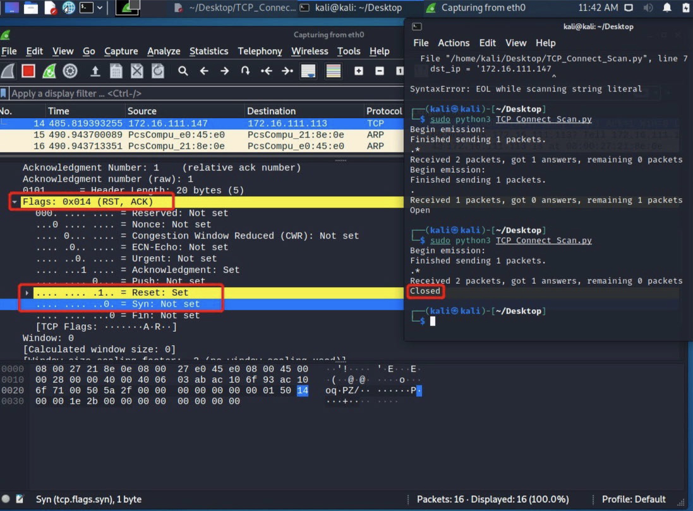

- `nmap` 复刻

```
nmap -sT 172.16.111.147
```

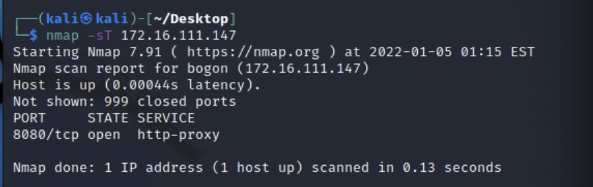

##### 端口开放

```
sudo ufw enable && sudo ufw allow 80/tcp
```

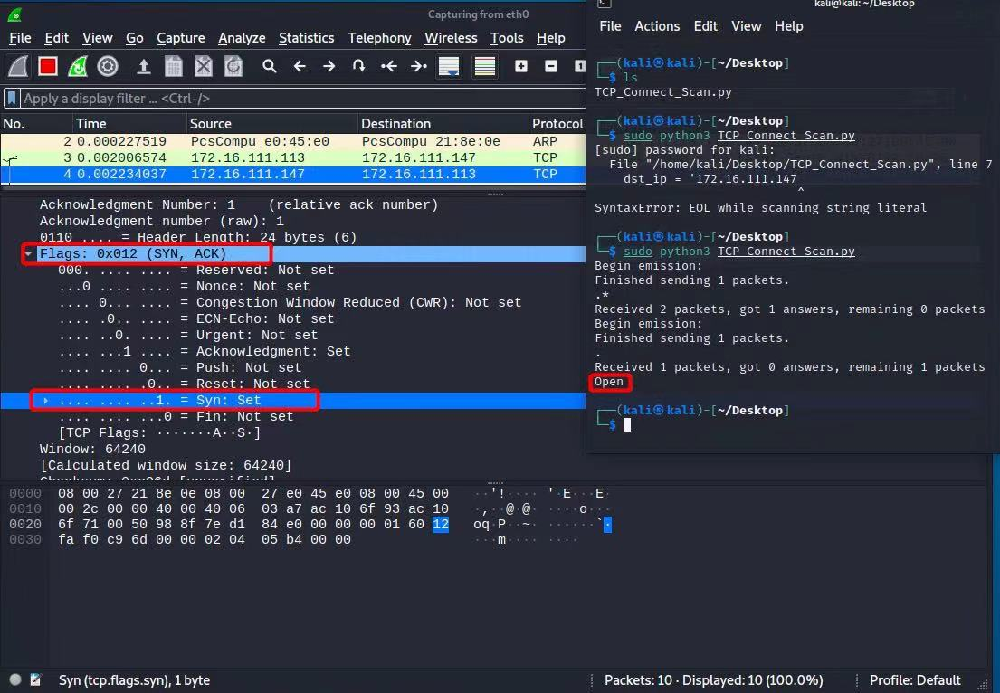

- `nmap` 复刻

```
nmap -sT 172.16.111.147
```

##### 端口过滤

```
sudo ufw enable && sudo ufw deny 80/tcp
```

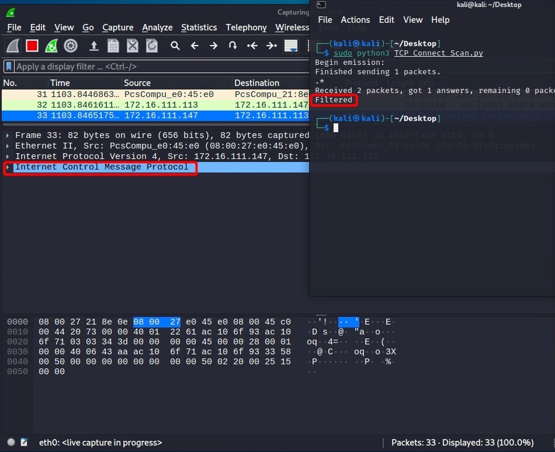

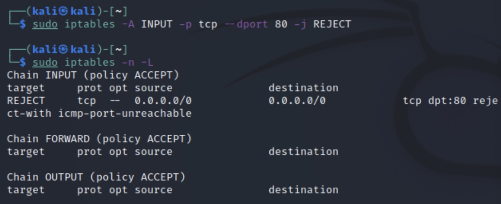

- `nmap` 复刻

```
nmap -sT 172.16.111.147
```
结果与课本中的扫描方法原理相符

- TCP stealth scan

发送一个 `S`等待回应
如果有回应且标识为 `RA`：目标端口处于关闭状态
如果有回应且标识为 `SA`：目标端口处于开放状态，这时 `TCP stealth scan` 只回复一个 `R`，不完成三次握手，直接取消建立连接

```python
from scapy.all import *

def tcpstealthscan(dst_ip, dst_port, timeout=10):
    pkts = sr1(IP(dst=dst_ip)/TCP(dport=dst_port, flags="S"), timeout=10)
    if (pkts is None):
        print("Filtered")
    elif(pkts.haslayer(TCP)):
        if(pkts.getlayer(TCP).flags == 0x12):
            send_rst = sr(IP(dst=dst_ip) /
                          TCP(dport=dst_port, flags="R"), timeout=10)
            print("Open")
        elif (pkts.getlayer(TCP).flags == 0x14):
            print("Closed")
        elif(pkts.haslayer(ICMP)):
            if(int(pkts.getlayer(ICMP).type) == 3 and int(stealth_scan_resp.getlayer(ICMP).code) in [1, 2, 3, 9, 10, 13]):
                print("Filtered")

tcpstealthscan('172.16.111.147', 80)

```

##### 端口关闭

```
sudo ufw disable
```

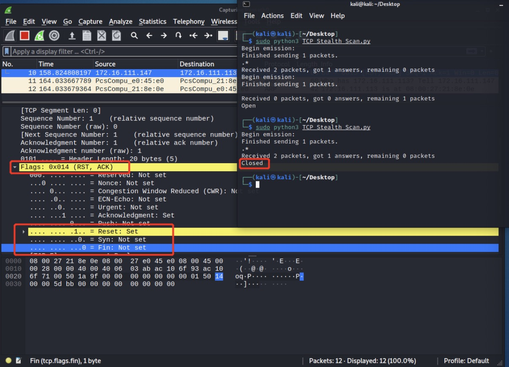

- `nmap` 复刻

```
sudo nmap -sS -p 8080 172.16.111.147
```

##### 端口开放

```
sudo ufw enable && sudo ufw allow 8080/tcp
```

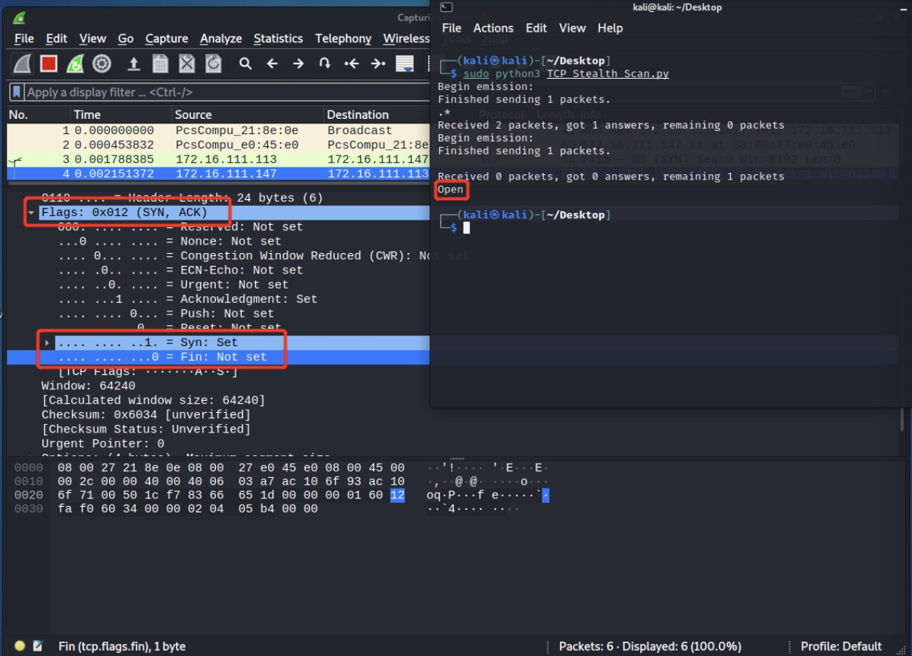

- `nmap` 复刻

```
sudo nmap -sS -p 8080 -n -vv 172.16.111.147
```
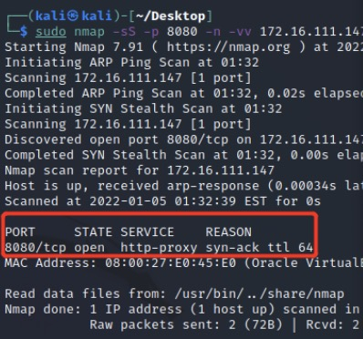

##### 端口过滤

```
sudo ufw enable && sudo ufw deny 8080/tcp
```

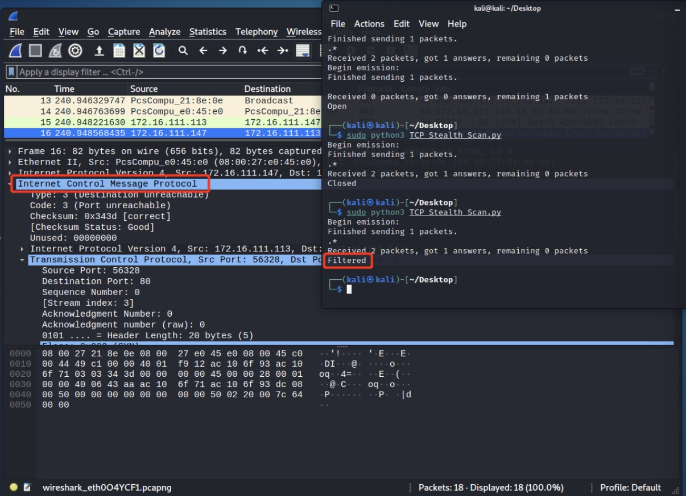

- `nmap` 复刻

```
sudo nmap -sS -p 8080 172.16.111.147
```
结果与课本中的扫描方法原理相符

- TCP Xmas scan

一种隐蔽性扫描，当处于端口处于关闭状态时，会回复一个 `RST` 包
其余所有状态都将不回复

```python
from scapy.all import *

def Xmasscan(dst_ip, dst_port, timeout=10):
    pkts = sr1(IP(dst=dst_ip)/TCP(dport=dst_port, flags="FPU"), timeout=10)
    if (pkts is None):
        print("Open|Filtered")
    elif(pkts.haslayer(TCP)):
        if(pkts.getlayer(TCP).flags == 0x14):
            print("Closed")
    elif(pkts.haslayer(ICMP)):
        if(int(pkts.getlayer(ICMP).type) == 3 and int(pkts.getlayer(ICMP).code) in [1, 2, 3, 9, 10, 13]):
            print("Filtered")

Xmasscan('172.16.111.147', 8080)
```

##### 端口关闭

```
sudo ufw disable
```

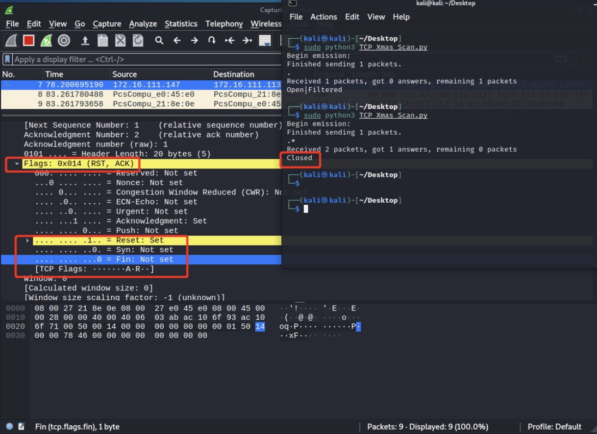

- `nmap` 复刻

```
sudo nmap -sX -p 8080 -n -vv 172.16.111.147
```

##### 端口开放

```
sudo ufw enable && sudo ufw allow 80/tcp
```

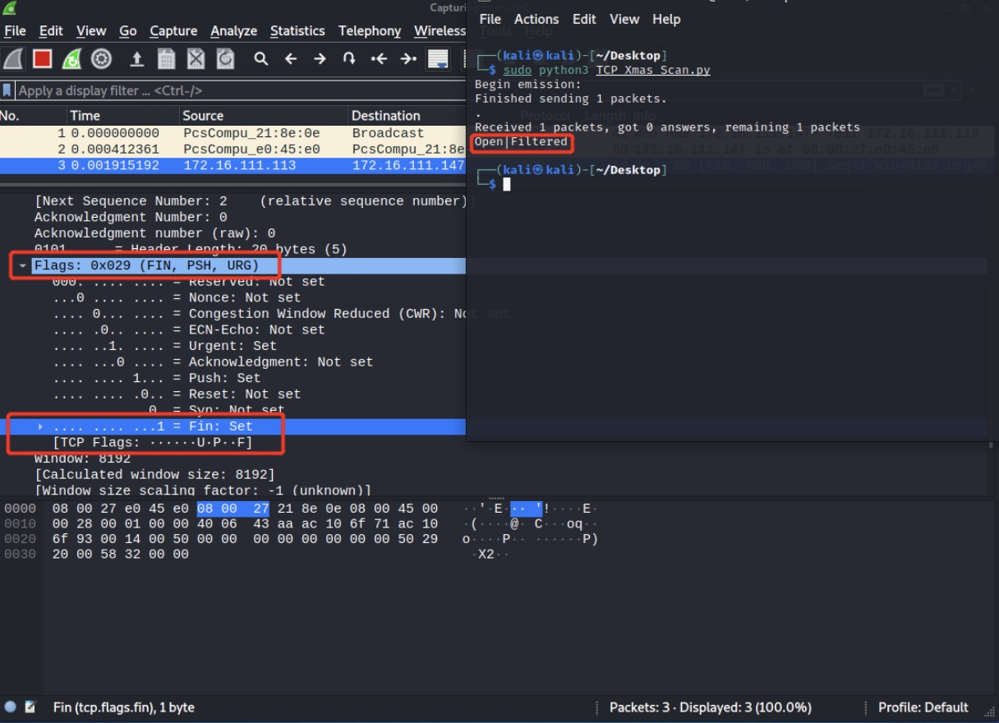

- `nmap` 复刻

```
sudo nmap -sX -p 8080 -n -vv 172.16.111.147
```

##### 端口过滤

```
sudo ufw enable && sudo ufw deny 8080/tcp
```

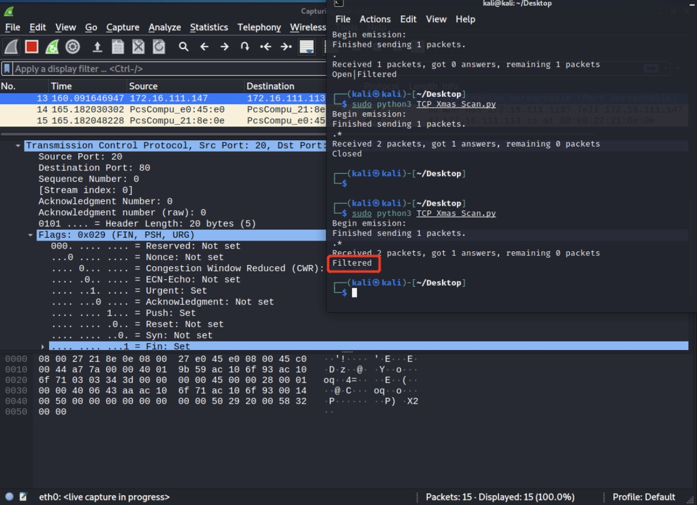

- `nmap` 复刻

```
sudo nmap -sX -p 8080 -n -vv 172.16.111.147
```

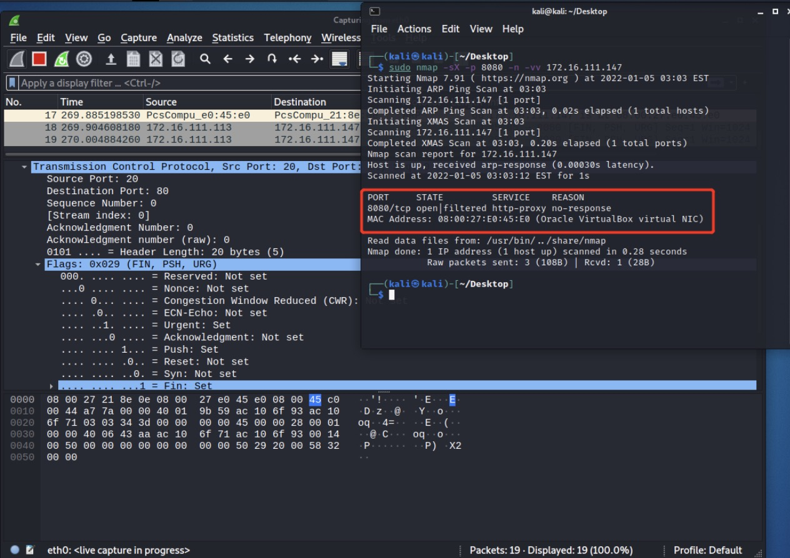
结果与课本中的扫描方法原理相符

-  TCP fin scan

仅发送 `FIN` 包，`FIN` 数据包能够通过只监测 `SYN` 包的包过滤器，隐蔽性较 `SYN` 扫描更⾼
此扫描与 `Xmas` 扫描也较为相似，只是发送的包 `FIN` 包
同理，收到 `RST` 包说明端口处于关闭状态；反之说明为开启/过滤状态

```python
from scapy.all import *


def finscan(dst_ip, dst_port, timeout=10):
    pkts = sr1(IP(dst=dst_ip)/TCP(dport=dst_port, flags="F"), timeout=10)
    if (pkts is None):
        print("Open|Filtered")
    elif(pkts.haslayer(TCP)):
        if(pkts.getlayer(TCP).flags == 0x14):
            print("Closed")
    elif(pkts.haslayer(ICMP)):
        if(int(pkts.getlayer(ICMP).type) == 3 and int(pkts.getlayer(ICMP).code) in [1, 2, 3, 9, 10, 13]):
            print("Filtered")


finscan('172.16.111.147', 8080)
```

##### 端口关闭

```
sudo ufw disable
```

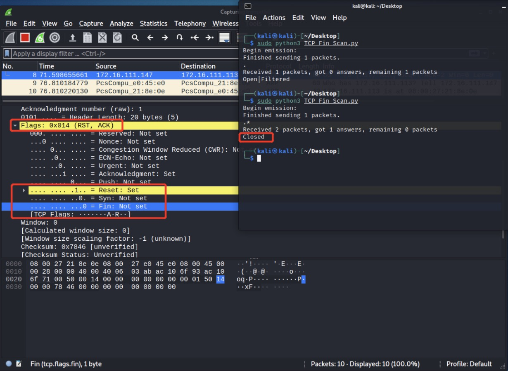

- `nmap` 复刻

```
nmap -sF -p 8080 -n -vv 172.16.111.147
```

##### 端口开放

```
sudo ufw enable && sudo ufw allow 8080/tcp
```

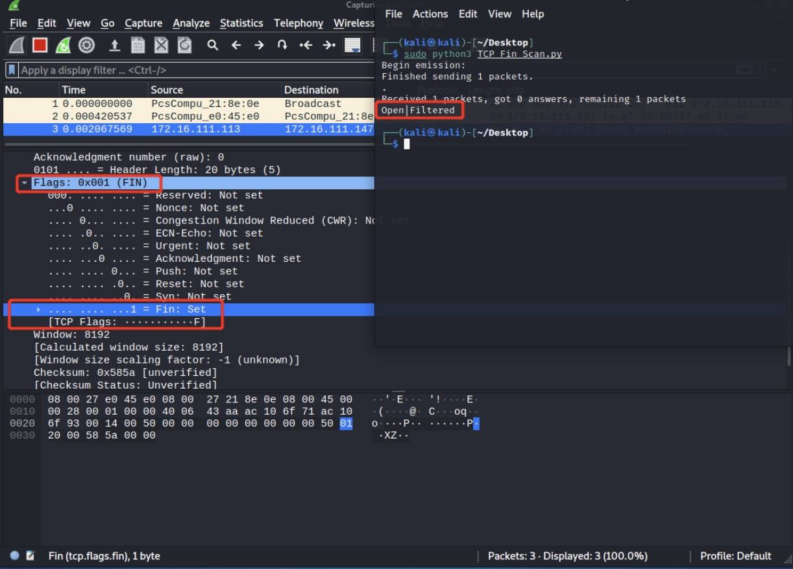

- `nmap` 复刻

```
nmap -sF -p 8080 -n -vv 172.16.111.147
```

##### 端口过滤

```
sudo ufw enable && sudo ufw deny 8080/tcp
```

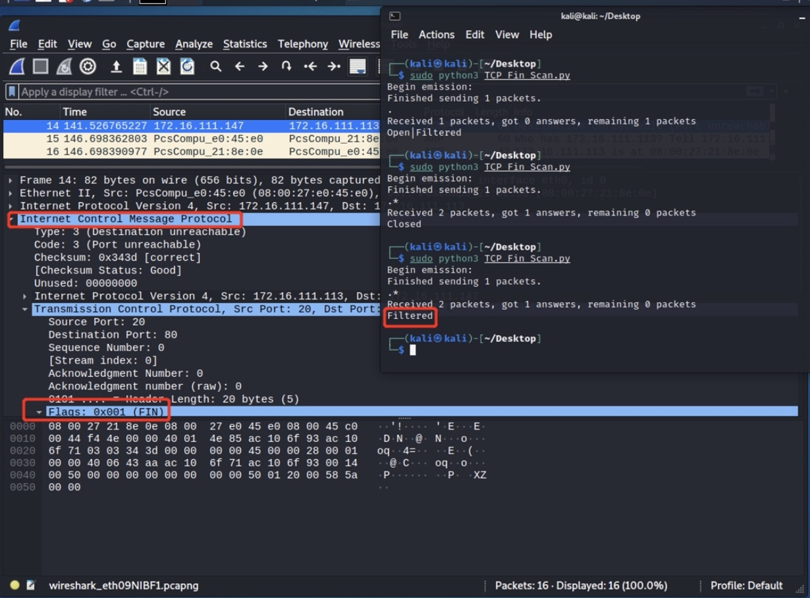

- `nmap` 复刻

```
nmap -sF -p 8080 -n -vv 172.16.111.147
```

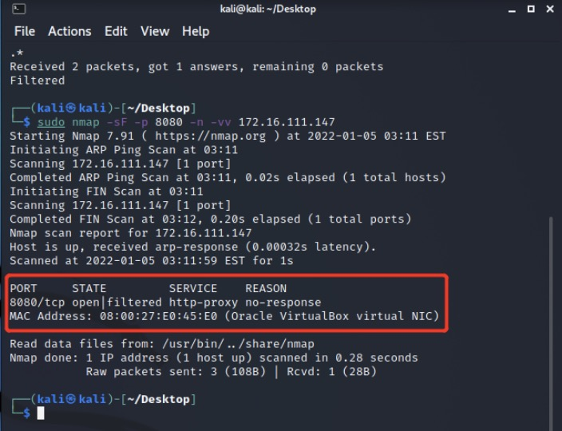
结果与课本中的扫描方法原理相符

- TCP null scan

发送的包中关闭所有 `TCP` 报⽂头标记
同理：收到 `RST` 包说明端口为关闭状态，未收到包即为开启/过滤状态

```python
#! /usr/bin/python
from scapy.all import *

def nullscan(dst_ip, dst_port, timeout=10):
    pkts = sr1(IP(dst=dst_ip)/TCP(dport=dst_port, flags=""), timeout=10)
    if (pkts is None):
        print("Open|Filtered")
    elif(pkts.haslayer(TCP)):
        if(pkts.getlayer(TCP).flags == 0x14):
            print("Closed")
    elif(pkts.haslayer(ICMP)):
        if(int(pkts.getlayer(ICMP).type) == 3 and int(pkts.getlayer(ICMP).code) in [1, 2, 3, 9, 10, 13]):
            print("Filtered")

nullscan('172.16.111.147', 8080)
```
##### 端口关闭

```
sudo ufw disable
```

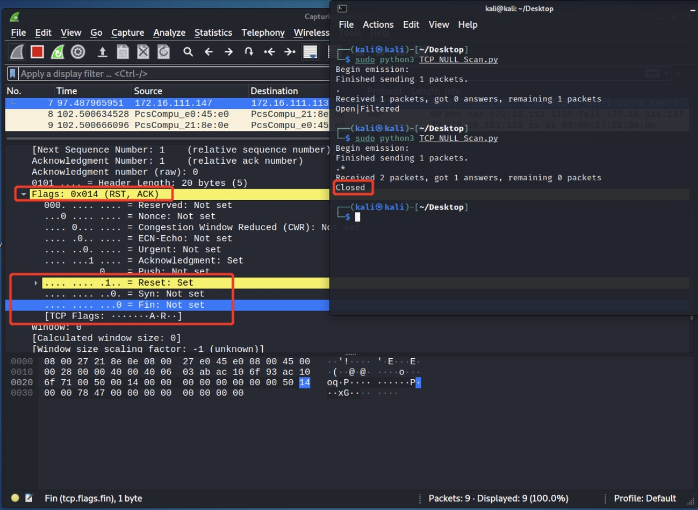

- `nmap` 复刻

```
nmap -sN -p 8080 -n -vv 172.16.111.147
```

##### 端口开放

```
sudo ufw enable && sudo ufw allow 8080/tcp
```

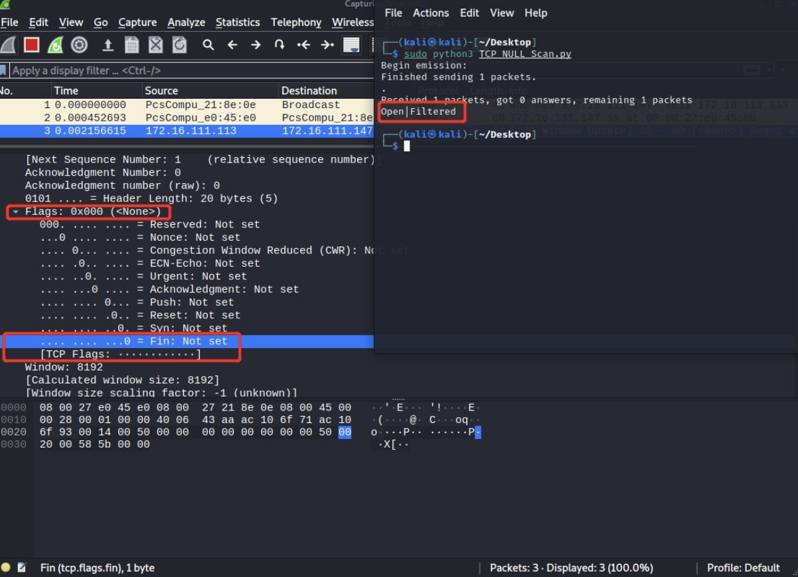

- `nmap` 复刻

```
nmap -sN -p 8080 -n -vv 172.16.111.147
```

##### 端口过滤

```
sudo ufw enable && sudo ufw deny 8080/tcp
```

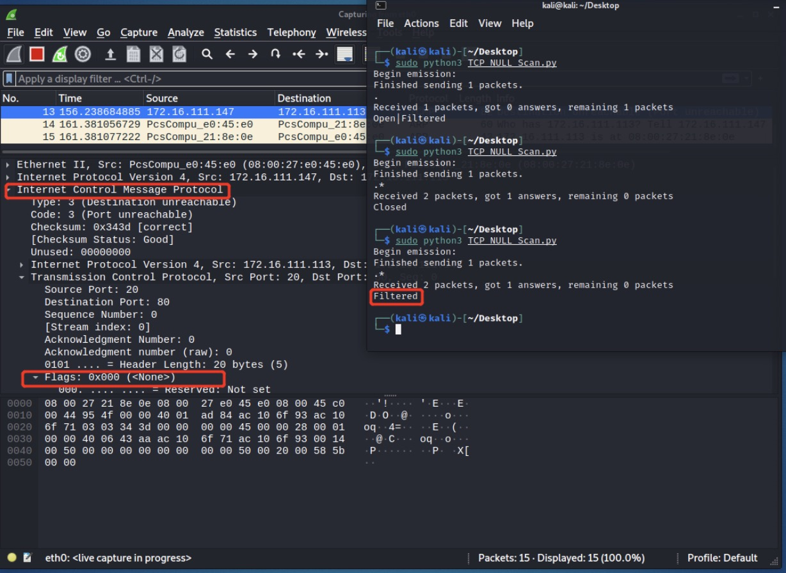

- `nmap` 复刻

```
nmap -sN -p 8080 -n -vv 172.16.111.147
```

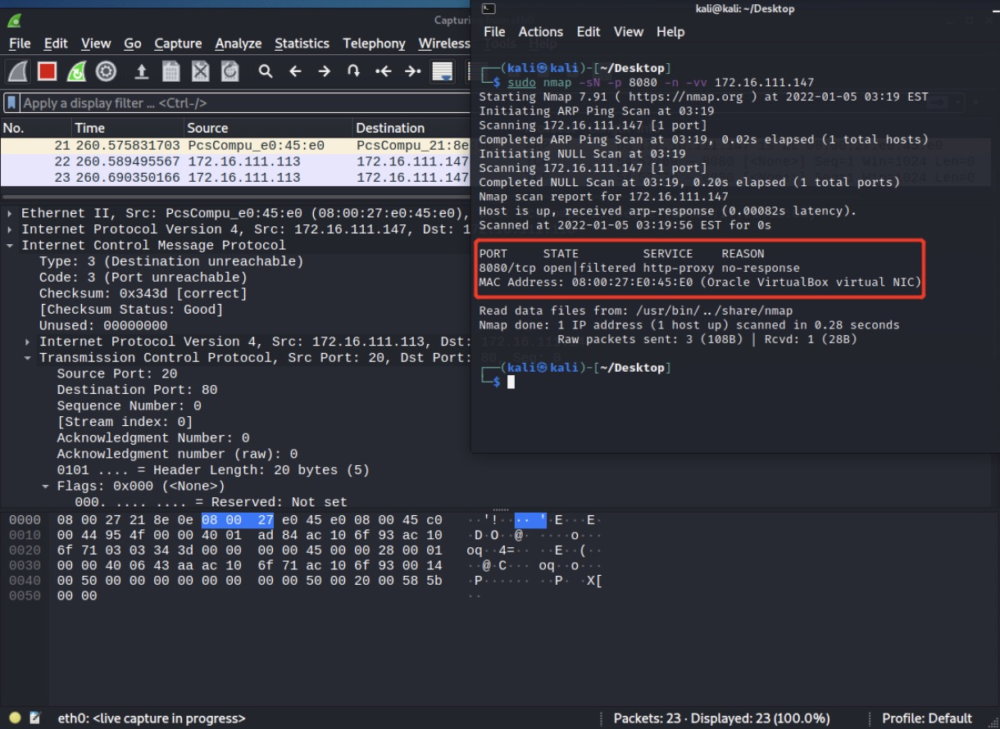
结果与课本中的扫描方法原理相符

- UDP scan

一种开放式扫描，通过发送 `UDP` 包进行扫描
当收到 `UDP` 回复时，该端口为开启状态
否则即为关闭/过滤状态

```python
from scapy.all import *
def udpscan(dst_ip, dst_port, dst_timeout=10):
    resp = sr1(IP(dst=dst_ip)/UDP(dport=dst_port), timeout=dst_timeout)
    if (resp is None):
        print("Open|Filtered")
    elif (resp.haslayer(UDP)):
        print("Open")
    elif(resp.haslayer(ICMP)):
        if(int(resp.getlayer(ICMP).type) == 3 and int(resp.getlayer(ICMP).code) == 3):
            print("Closed")
        elif(int(resp.getlayer(ICMP).type) == 3 and int(resp.getlayer(ICMP).code) in [1, 2, 9, 10, 13]):
            print("Filtered")
        elif(resp.haslayer(IP) and resp.getlayer(IP).proto == IP_PROTOS.udp):
            print("Open")
udpscan('172.16.111.147', 53)
```
##### 端口关闭

```
sudo ufw disable
```
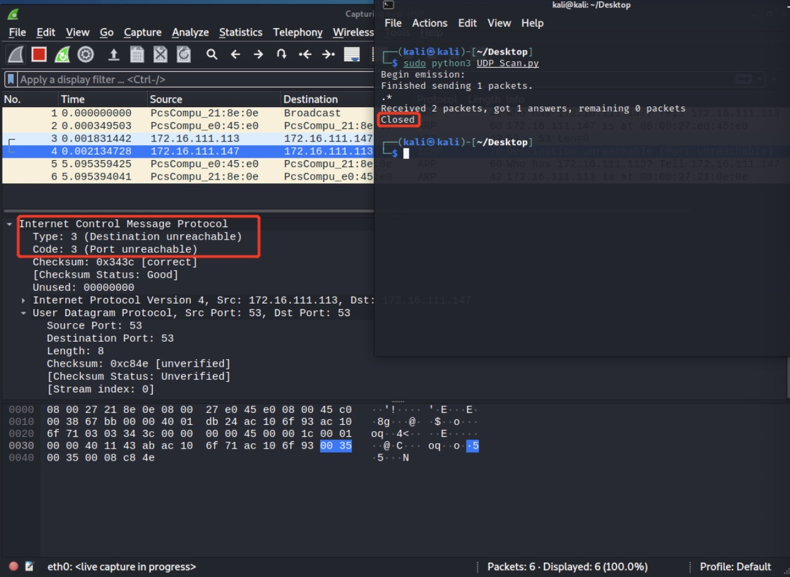

- `nmap` 复刻

```
sudo nmap -sU -p 53 -n -vv 172.16.111.147
```

##### 端口开放

```
sudo ufw enable && sudo ufw allow 53/tcp
```
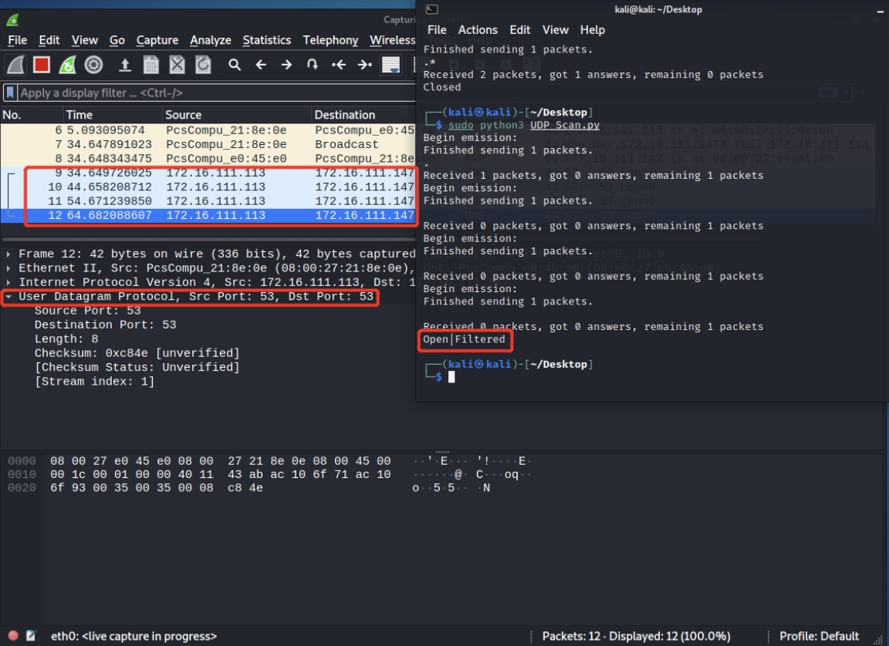

- `nmap` 复刻

```
sudo nmap -sU -p 53 -n -vv 172.16.111.147
```

##### 端口过滤

```
sudo ufw enable && sudo ufw deny 53/tcp
```
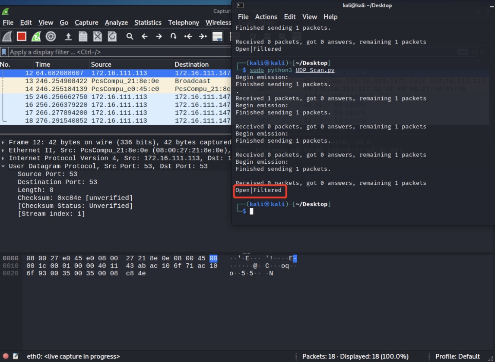

- `nmap` 复刻

```
sudo nmap -sU -p 53 -n -vv 172.16.111.147
```

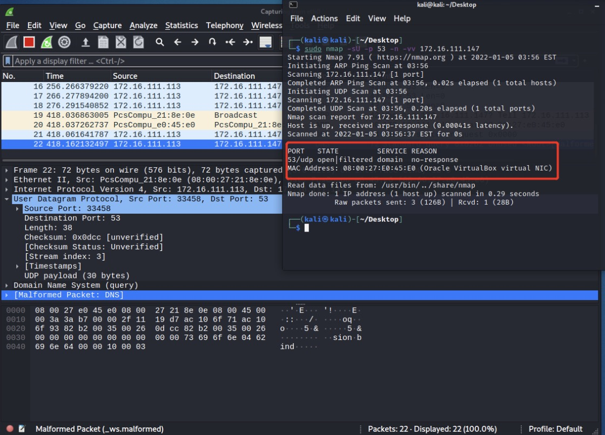
结果与课本中的扫描方法原理相符

## 实验问题

执行 `sudo ufw status` 指令时报错 `command not found`

解决方法：
```
sudo apt-get update
sudo apt-get install ufw
sudo ufw enable
```

端口开启和关闭 `nmap` 的返回值都一样
解决方法：
该用 `8080` 端口

出现 `Attribute Error` 的报错
解决方法：
修改字段 `<type 'NoneType'>` 为 `<class 'NoneType'>`

## 参考资料

[大佬的作业](https://github.com/CUCCS/2022-ns-public-HantaoGG/tree/chap0x05/chap0x05)
[nmap总结](https://blog.csdn.net/qq_43936524/article/details/108959977)